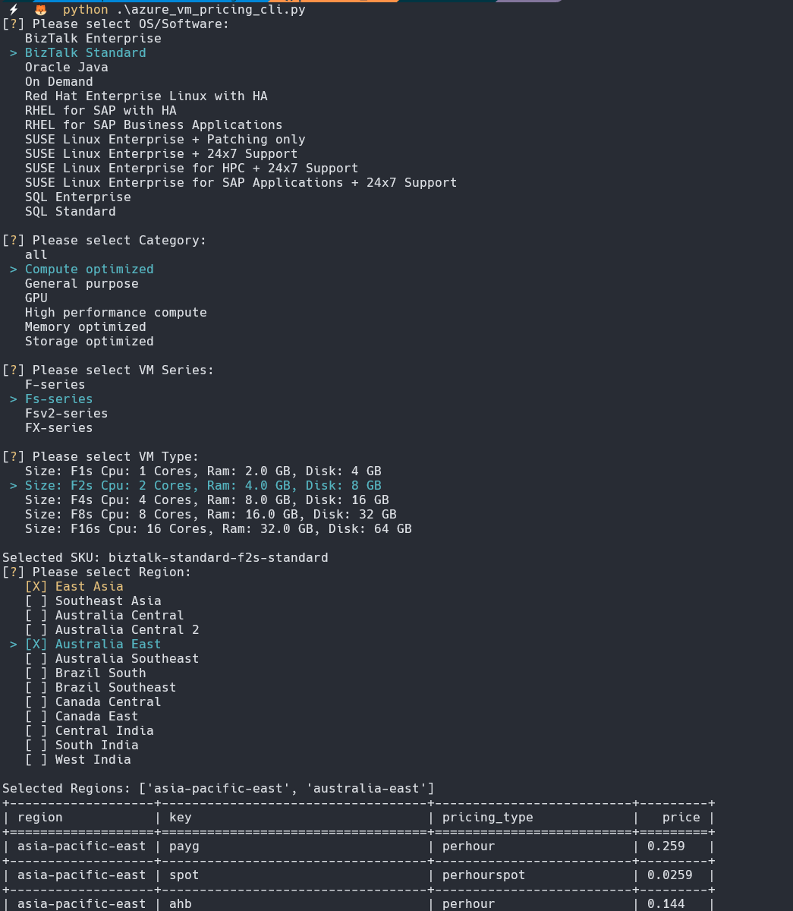

# Azure VM Pricing CLI Tool

This tool is specifically crafted to assist users in retrieving and showcasing the prices of virtual machine SKUs across various regions. It facilitates a comparative analysis, empowering users to make informed decisions on the optimal region for deploying their virtual machines from a cost perspective.




## Features

- Fetch virtual machine SKU prices.
- Interactive menus to select OS/software, category, VM series, VM type, and region.
- Display the pricing information in a tabulated format.

## Installation

Clone this repository to your local machine:

```bash
git clone https://github.com/emrgcl/AzureVMPricingCLI.git
```

Navigate to the cloned directory:

```bash
cd AzureVMPricingCLI
```

Install the required dependencies:

```bash
pip install -r requirements.txt

```

## Usage

o run the VM Pricing CLI tool, execute the following command in the terminal:

```bash
python azure_vm_pricing_cli.py
```

# Dependencies

- `inquirer`: For creating interactive command-line user interfaces.
- `yaspin`: To display spinners in the CLI for loading processes.
- `tabulate`: To format and display the data in a table.